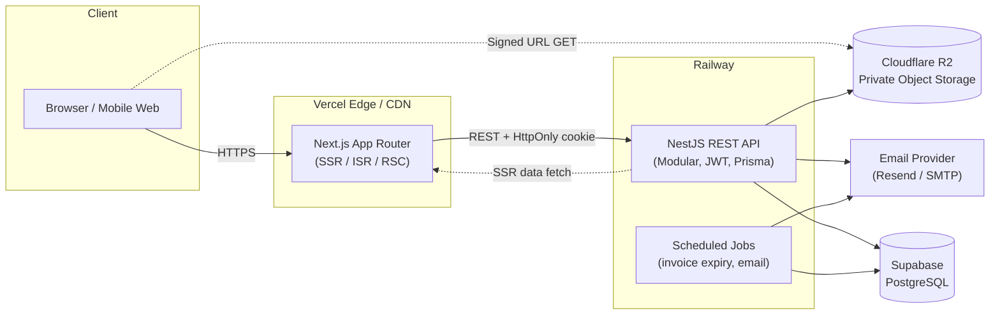
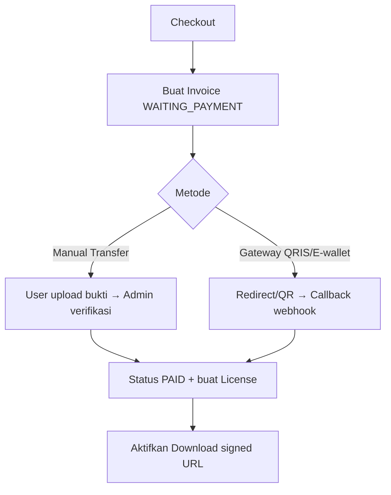
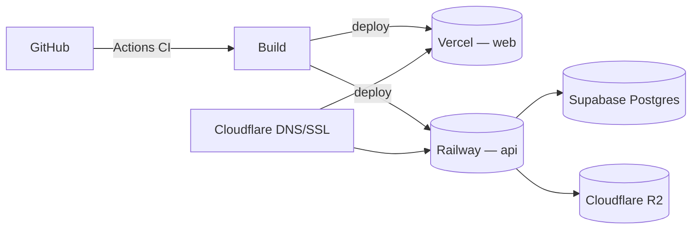

# Tahap 1 — Arsitektur Sistem

## 1. Gambaran Umum

Arsitektur **decoupled monorepo**: frontend (Next.js) dan backend (NestJS) terpisah,
berkomunikasi via REST/JSON. Object storage (Cloudflare R2) menyimpan file digital
secara privat; akses hanya lewat signed URL.



## 2. Pemisahan Lapisan (Clean Architecture pada API)

Setiap modul NestJS mengikuti pembagian tanggung jawab:

```
Controller  → HTTP boundary (validasi DTO via Zod/class-validator, auth guard)
Service     → Use-case / business rule (BR-*)
Repository  → Akses data via Prisma (satu-satunya yang menyentuh DB)
Domain      → Entity/type & aturan invarian
```

Prinsip:
- **Dependency rule**: lapisan dalam tidak tahu lapisan luar.
- **Repository pattern** membungkus Prisma agar mudah di-mock saat test & ditukar.
- **DTO** memisahkan bentuk API dari bentuk DB.

## 3. Modul Backend (NestJS)

| Modul | Tanggung jawab |
|-------|----------------|
| `AuthModule` | Register, login, refresh, logout, Argon2, JWT rotation. |
| `UsersModule` | Profil, ganti password, role. |
| `CatalogModule` | Products, Categories, Tags, Reviews. |
| `MediaModule` | Upload thumbnail/gallery, generate signed URL (R2). |
| `CartOrderModule` | Cart, Order, Invoice, License. |
| `PaymentModule` | PaymentProof, verifikasi admin, provider adapter. |
| `CouponModule` | Validasi & penerapan kupon. |
| `DownloadModule` | Otorisasi & pembuatan signed URL berbatas waktu/kuota. |
| `WishlistModule` | Simpan produk favorit. |
| `BlogModule` | Post, kategori, tag, komentar. |
| `ContentModule` | Banner, Testimonial, FAQ, SiteSetting, SEO meta. |
| `AdminModule` | Agregasi dashboard & statistik. |
| `NotificationModule` | Email + event. |
| `AuditModule` | Audit log lintas aksi sensitif. |
| `HealthModule` | Liveness/readiness. |

## 4. Aliran Pembayaran (Provider-Agnostic)



`PaymentProvider` adalah interface. Fase 1 memakai `ManualTransferProvider`.
Fase berikut cukup menambah `MidtransProvider` / `XenditProvider` tanpa mengubah
`CartOrderModule`.

## 5. Keamanan (ringkas — detail di `docs/security` & kode)

- **Transport**: HTTPS everywhere, HSTS.
- **AuthN**: Argon2id hash, access token (JWT, 15 menit) + refresh token (7 hari, HttpOnly, Secure, SameSite=Strict), rotasi + reuse detection.
- **AuthZ**: Role guard (`USER`/`ADMIN`), ownership check.
- **Web**: Helmet, CORS allowlist, rate limiting (Throttler), CSRF token untuk mutasi cookie-based, input validation + sanitization, output encoding.
- **Data**: Prisma parameterized queries (anti SQLi), signed URL privat, audit log.

## 6. Performa & Caching

| Teknik | Lokasi |
|--------|--------|
| SSR + ISR (revalidate) | Halaman produk & blog (Next.js) |
| RSC + streaming | Home & listing |
| HTTP cache / CDN | Vercel edge |
| Query caching | TanStack Query (client), Cache-Control (API) |
| Image optimization | `next/image`, format modern |
| Code splitting & lazy | Dynamic import komponen berat |
| DB index | Kolom filter/sort (lihat schema) |

## 7. Observability

- Structured logging (pino) + request id.
- Health endpoints (`/health/live`, `/health/ready`).
- Audit log tabel untuk aksi sensitif (login gagal, verifikasi bayar, download).
- Error tracking siap (Sentry DSN via env, opsional).

## 8. Deployment Topologi


