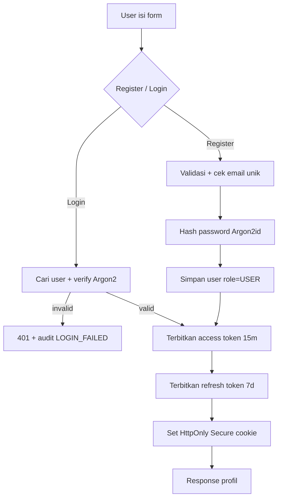
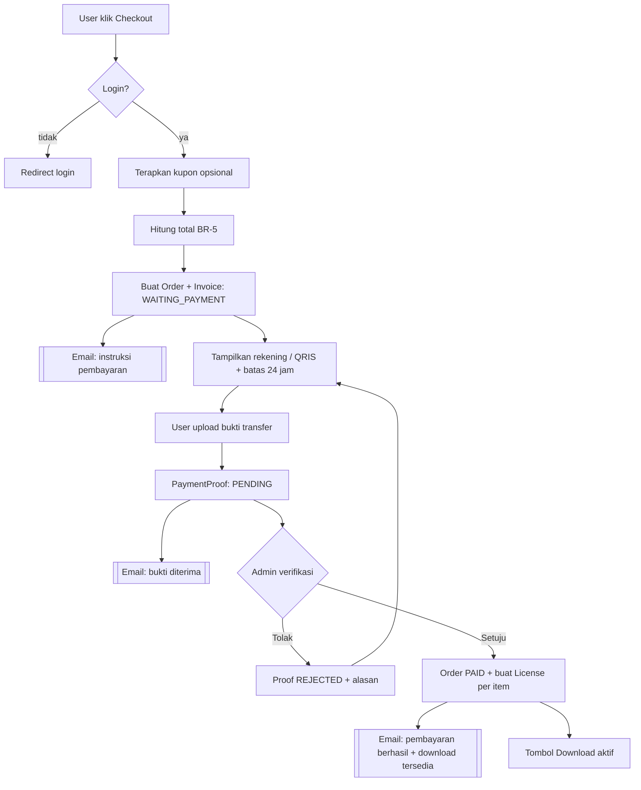
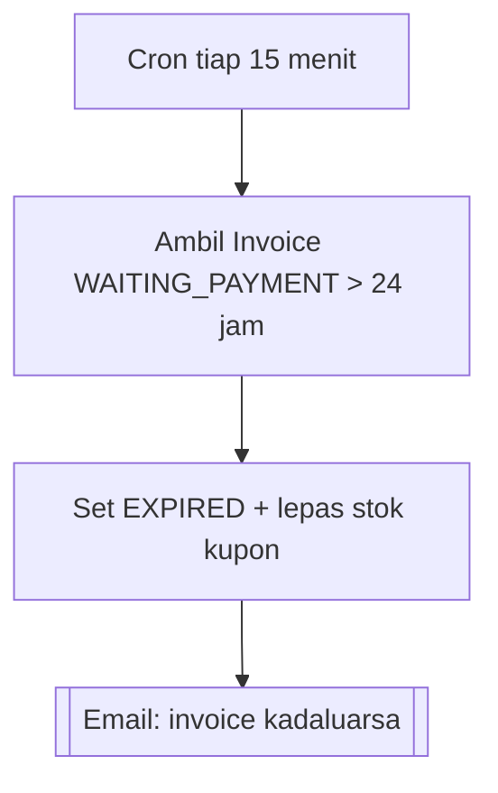
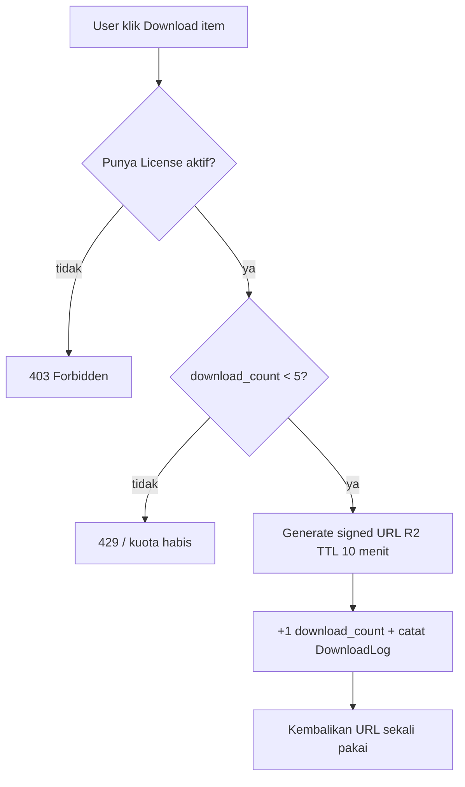
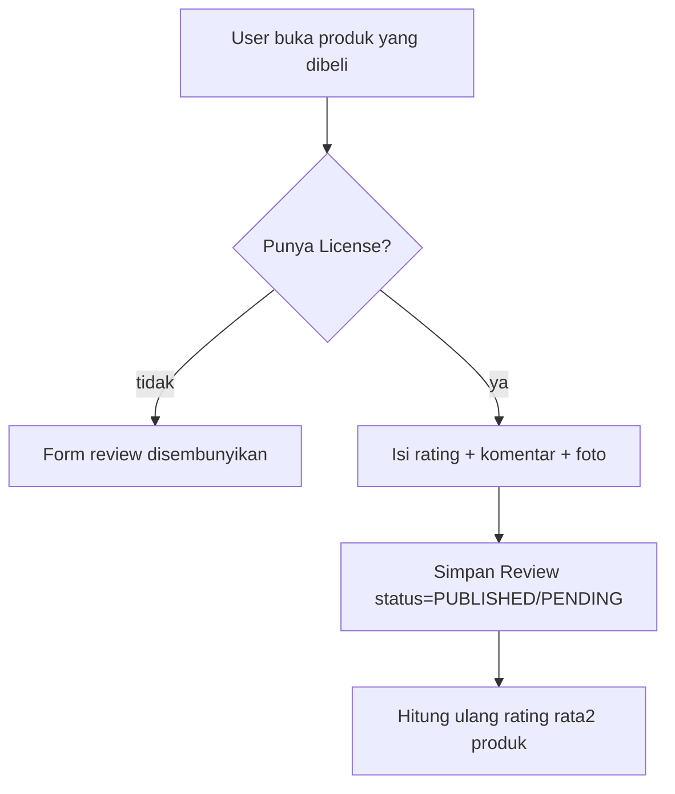
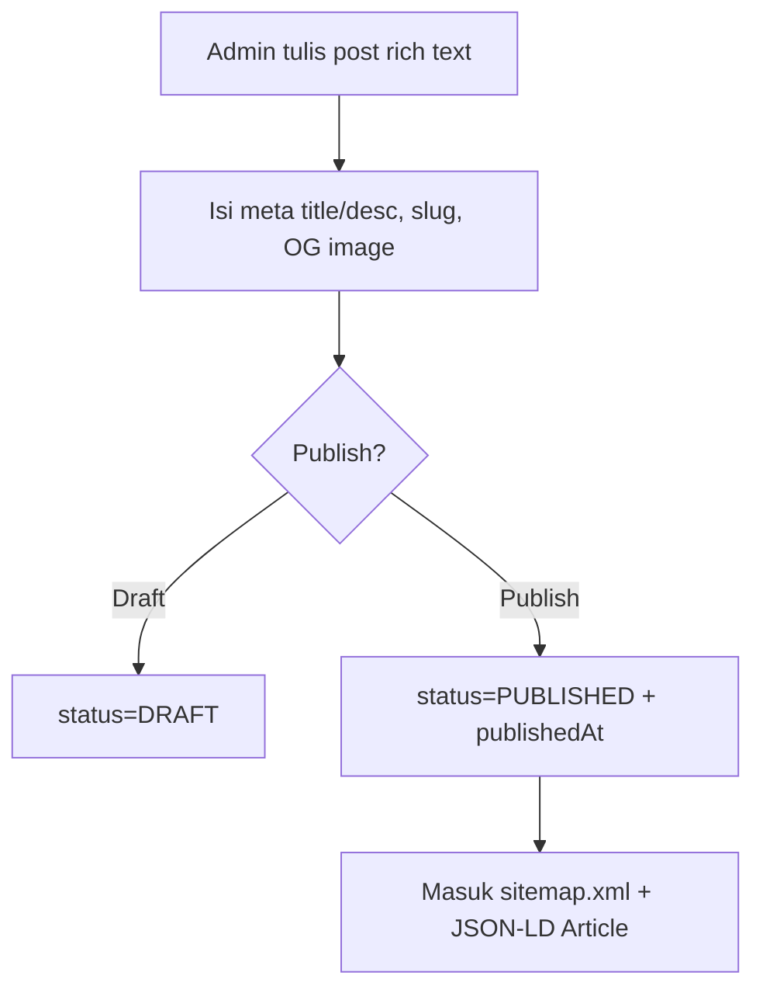

# Tahap 1 — Flowchart Proses Utama

## 1. Registrasi & Login (JWT + Refresh Rotation)

Refresh: klien memanggil `/auth/refresh`; server memvalidasi refresh token, **mendeteksi reuse** (token lama sudah dipakai → cabut seluruh sesi), lalu menerbitkan pasangan token baru.

## 2. Checkout → Invoice → Verifikasi Manual → Download

## 3. Kadaluarsa Invoice (Scheduled Job — BR-1)

## 4. Download Aman (BR-2, BR-3, FR-D)

## 5. Review Produk (BR-4)

## 6. Publikasi Blog & SEO

