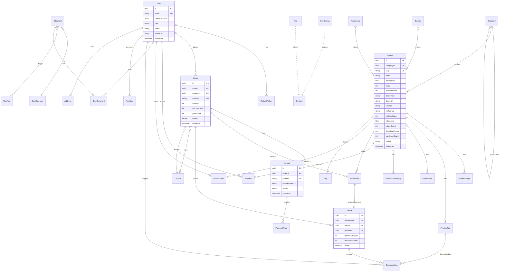

# Tahap 1 — Entity Relationship Diagram (ERD)

Semua entitas memakai **UUID** primary key, **timestamp** (`createdAt`, `updatedAt`),
dan **soft delete** (`deletedAt`) pada entitas inti.

## Catatan Relasi Penting

- **Order 1—1 Invoice**: satu order menghasilkan satu invoice pembayaran.
- **OrderItem 1—1 License**: setiap item yang dibeli membuka satu lisensi download (kuota terpisah per item).
- **License 1—N DownloadLog**: setiap upaya download dicatat (untuk kuota & audit).
- **Category self-relation**: mendukung kategori & subkategori (`parentId`).
- **Product N—N Tag**, **BlogPost N—N BlogTag**: via tabel relasi implisit Prisma.
- **Coupon 1—N Order**: satu kupon dipakai banyak order (dengan batas & kadaluarsa).

Detail tipe kolom & index ada di `apps/api/prisma/schema.prisma` dan `05-database-design.md`.
